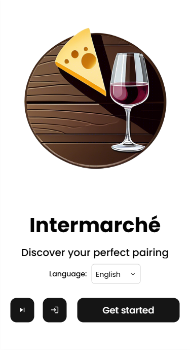
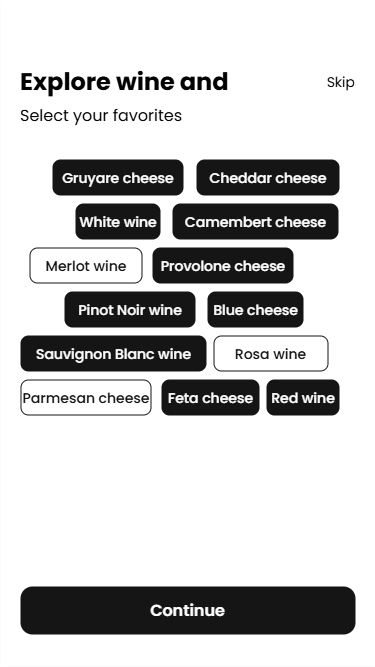
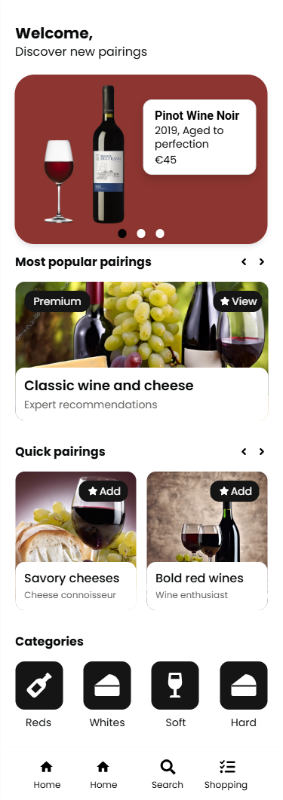
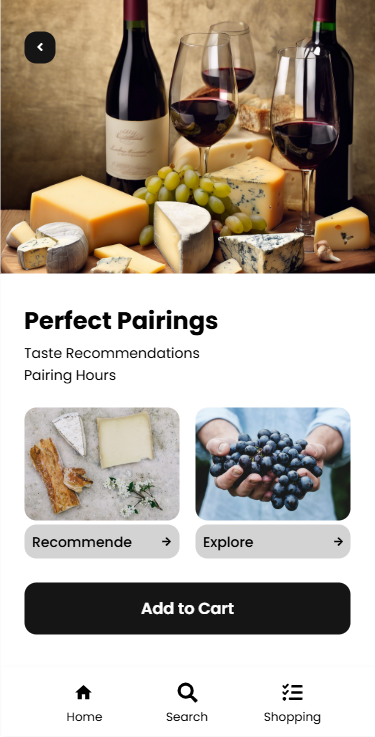
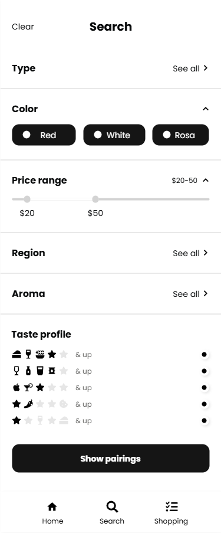
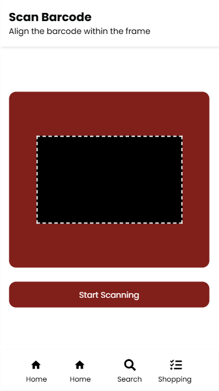
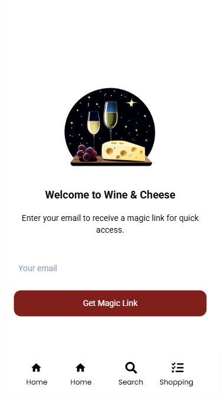

# Functional Specifications - Intermarché Web App

## Author

|       Name       |       Role       |
| ---------------- | ---------------- |
| Yann-Maël Bouton | Program Manager  |

## Modifications

|       Date       |    Description    |
| ---------------- | ----------------- |
|    28/04/2025    | Creation of the document |
|    30/04/2025    | Started filling section  |
|    05/05/2025    | Added stakeholder & success criteria. |
|    11/05/2025    | Completed the entire document (only mockup need to be finished) |
|    13/05/2025    | Reworked and enhanced several parts. |
|    14/05/2025    | Final version (waiting for QA verification) |

---

Table of content

- [1. Introduction](#1-introduction)  
  - [1.1 Purpose](#1-1-purpose)  
  - [1.2 Scope of Functional Specifications](#1-2-scope-of-functional-specifications)  
  - [1.3 Definitions & Acronyms](#1-3-definitions--acronyms)  
  - [1.4 Team Members](#1-4-team-members) 
  - [1.5 Stakeholders](#1-5-stakeholders)  

- [2. Business Context](#2-business-context)  
  - [2.1 Problem Statement](#2-1-problem-statement)  
  - [2.2 Objectives & Goals](#2-2-objectives--goals)  
  - [2.3 Success Criteria](#2-3-success-criteria)  

- [3. Functional Scope](#3-functional-scope)  
  - [3.1 In-Scope Features](#3-1-in-scope-features)  
  - [3.2 Out-of-Scope Items](#3-2-out-of-scope-items)  

- [4. User Roles & Permissions](#4-user-roles--permissions)  
  - [4.1 User Roles](#4-1-user-roles)  
  - [4.2 Permission Matrix](#4-2-permission-matrix)  

- [5. Use Cases & Audience](#5-use-cases--audience)  
  - [5.1 Audience](#5-1-audience)  
  - [5.2 Detailed Use Cases](#5-2-detailed-use-cases)

- [6. Functional Requirements](#6-functional-requirements)  
  - [6.1 Overview & Prioritization](#6-1-overview--prioritization)   

- [7. Wireframe](#7-wireframe)  

- [8. High-level database architecture](#8-high-level-database-architecture)  

- [9. Privacy & Security Considerations](#9-privacy--security-considerations)

- [10. Business Rules](#10-business-rules)  

- [11. Non-Functional Considerations](#11-non-functional-considerations)  
  - [11.1 Performance Expectations](#11-1-performance-expectations)  
  - [11.2 Compliance & Regulations](#11-2-compliance--regulations)  

---

## 1. Introduction

### 1.1 Purpose

Create and implement a very easy-to-use, bilingual, and progressive online application that can be accessed using a QR code at the store's entry. The objective is to increase sales and improve the shopping experience for visitors in the wine and cheese sections.

### 1.2 Scope of Functional Specifications

Covers all in-scope features including product lookup, recommendations, bilingual UI, and QR-code access. Excludes native apps, full backend/admin interface, offline capability, barcode scanning and integration beyond top-100 products.

### 1.3 Definitions & Acronyms

| Abbreviation | Meaning                                    |
| ------------ | ------------------------------------------ |
| PWA          | Progressive Web App                        |
| QR           | Quick Response                             |
| EAN          | European Article Number (barcode standard) |
| ITM8         | Intermarché internal barcode prefix        |

### 1.4 Team Members

| Name              | Function          | Role Description                                                                                                    | Their Github                                                                                                                     | Their LinkedIn                                                                                                                                                   |
| ----------------- | ----------------- | ------------------------------------------------------------------------------------------------------------------- | -------------------------------------------------------------------------------------------------------------------------------- | ---------------------------------------------------------------------------------------------------------------------------------------------------------------- |
| Yann-Maël BOUTON  | Program Manager   | Oversees program strategy, coordinates the projects and stakeholders to align with business objectives.        |    |           |
| Geoffrey DELRIEU  | Project Manager   | Plans and tracks project timelines, resources, and deliverables to ensure on-time, on-budget completion.            |     |   |
| Loïc NOGUES       | Technical Lead    | Guides the technical vision, mentors engineers, and ensures architectural integrity.                                |  |        |
| Alexis SANTOS     | Software Engineer | Designs, writes, tests, and maintains code to implement features and fix bugs.                                      |    |      |
| Salaheddine NAMIR | Quality Insurance | Defines testing strategy, executes QA processes and ensures the product meets quality standards.                    |       |  |
| Michel RIFF       | Technical Writer  | Creates and maintains clear, user-friendly documentation and guides for both technical and non-technical audiences. |   |        |

### 1.5 Stakeholders

| Representative      | Entity           |
| ----------------- | ----------------- |
| [Franck JEANNIN](https://fr.linkedin.com/in/franck-jeannin) | [ALGOSUP](https://www.algosup.com/) (Supervisor) |
| [Chrys CADEAU](chryscadeau13@gmail.com) & [Célia MOUSTIER](moustier09@hotmail.fr) | [Intermarché](https://www.intermarche.com/) (Project Owner) |
| [Geoffrey DELRIEU](https://www.linkedin.com/in/geoffrey-delrieu-77203a353/) | [Team 1](https://github.com/algosup/2024-2025-project-5-bubble-intermarche-team-1) (Project Owner) |
| [Yann-Maël BOUTON](https://www.linkedin.com/in/ym-bouton-a38565339) | [Team 1](https://github.com/algosup/2024-2025-project-5-bubble-intermarche-team-1) (Project Representative) |

## 2. Business Context

### 2.1 Problem Statement

Tourists in the wine & cheese aisles lack quick product information and pairing guidance, leading to decision delays and missed upsell opportunities.

### 2.2 Objectives & Goals

Reduce product decision time to under 30 seconds, increase cross-sell rate by 15% among scanned items and highlight unknown wines to drive incremental revenue.

### 2.3 Success Criteria

- 20% uplift in average cart size from wine/cheese sections
- Positive user satisfaction feedback ≥4/5

## 3. Functional Scope

#### In-Scope Features

  - Personalized user experiences (UI/UX) through question list.
  - Display high resolution product images.
  - Hidden feedback to enhance recommendation.
  - Recommended pairings and recipe suggestions.
  - Bilingual UI (minimum language : EN and FR).
  - Search engine for product.
  - User authentication through SMS/EMAIL magic link.
  - Barcode/EAN scanning via device camera that will redirect to the product page.

#### Out-Scope Features

  - Admin panel to add, modify or delete product.
  - Native app (available on play store and apple store) / Shortcut app.
  - Integration beyond top-100 product.

## 4. User Roles & Permissions

### 4.1 User Roles

  - Shopper (anonymous)
  - Shopper (logged in) (* Shopper LI)
  - Store Staff (content update via admin platform) (OUT OF SCOPE)

### 4.2 Permission Matrix

| Role        | Scan Products | View Details | Apply Filters | Update Top-100 List | Save Own Experiences | Give Product Feedback |
|-------------|---------------|--------------|---------------|---------------------|----------------------|-----------------------|
| Shopper     | ✔️            | ✔️           | ✔️            | ✖️                 | ✖️                 | ✖️                   |
| Shopper LI  | ✖️            | ✖️           | ✖️            | ✔️                 | ✔️                 | ✔️                   |
| Store Staff | ✖️            | ✖️           | ✖️            | ✔️                 | ✖️                 | ✖️                   |

## 5. Use Cases & Audience

### 5.1 Audience

Persona 1: Sam the Tourist (Guest Shopper)

**Age & Background**: 29-year-old English-speaking tourist, first time in France.

**Tech Proficiency**: Comfortable with smartphones, but unlikely to install or register.

**Goals**: Instantly access bilingual product info via QR code and get quick pairing suggestions without logging in.

**Frustrations**: Any delay in loading or having to create an account and overly complex navigation in a foreign language

___

Persona 2: Claire the Local Foodie (Logged-In Shopper)

**Age & Background**: 35-year-old Paris resident, regularly shops at Intermarché.

**Tech Proficiency**: Moderate, uses mobile apps for shopping and recipes.

**Goals**: Save her taste preferences and order history and receive personalized wine-and-cheese recommendations based on past likes.

**Frustrations**: Losing her session or preferences if she’s not logged in and generic suggestions that don’t match her known tastes.

___

Persona 3: Jean the Enthusiast (Power User)

**Age & Background**: 50-year-old wine connoisseur, avid label-scanner

**Tech Proficiency**: High; uses advanced filters and barcode / EAN scanning frequently

**Goals**: Dive deep into origin, style and intensity data compare products and save favorites for future visits.

**Frustrations**: Slow or inaccurate barcode scans and limited filtering options or lack of high-resolution images.

### 5.2 Detailed Use Cases

#### UC1: Access App

- **Actors**: Guest Shopper, Logged-in Shopper
- **Preconditions**: User is in-store and scans the QR code displayed in the wine or cheese aisle.
- **Main Flow**:

  **1.** User scans QR code with his smartphone, tablet, mobile phone or any other device.
  **2.** PWA loads and shows a language selector (FR/EN).
  **3.** User selects preferred language.
  **4.** The system queries whether the user already has a session token.
     **1.** In case a token exists, then the execution goes on to step 7.

  **5.** User is asked to complete a quick preference quiz (optional on first visit).
  **6.** User may enter email/SMS to receive a magic link for login (optional).
  **7.** System displays the personalized home screen with product recommendations and catalog access.

- **Alternative Flows**:
  **A1**: User skips quiz and magic link entry → System proceeds with default recommendations in guest mode.
- **Postconditions**: App home screen is rendered with appropriate navigation and recommendations.

___

#### UC2: View Product Details

- **Actors**: Guest Shopper, Logged-in Shopper
- **Preconditions**: User has successfully accessed the app (UC1 completed).
- **Main Flow**:

  **1.** User navigates using search, filters.
  **2.** User choose a product from the results list.
  **3.** The system shows the product's details page with the following information:

     - Clear, large images
     - Product name, origin, and description
     - Recommended pairings (wine with cheese and vice versa)

  **4.** The user can move back for browsing or select other products for viewing.

- **Alternative Flows**:
  **A1**: After a user makes a search, and the system does not bring up any results → The system shows 'No matches found' and recommends that the user clears the filters or uses other keywords.
- **Postconditions**: User has watched detailed info as well as pairing suggestions.

___

#### UC3: Get Personalized Recommendations

- **Actors**: Guest Shopper, Logged-in Shopper
- **Preconditions**: User is on home or product listing screen and either first-time user or chooses to update preferences.
- **Main Flow**:

  **1.** User taps the "Preferences" icon/button.
  **2.** System presents up to 5 questions on styles and preferences.

    - Preferred wine types (e.g.: red, white)
    - Style preferences (e.g.: full-body, crisp)
    - Cheese texture (e.g.: soft, hard)
    - Milk type (e.g.: cow, goat, sheep)
    - Intensity/strength

  **3.** User answers the questions, system applies the logic of skipping on the basis of responses of questions.
  **4.** System recalculates and displays new recommendations.

- **Alternative Flows**:
  **A1**: User quits quiz midway → System keeps previous / default preference set and updates only based on completed answers.
- **Postconditions**: The Recommendations given have to match the user's explicitly stated preferences.

___

#### UC4: Save Session & Prompt Registration

- **Actors**: Guest Shopper
- **Preconditions**: The current user has at least interacted with five products during the ongoing session.
- **Main Flow**:

  **1.** The system track the user's contacts with the products (views, filters applied, quiz participation).
  **2.** After the fifth interaction, the system gives a one-time registration prompt.
  **3.** The prompt is telling about the benefits of saving preferences and order history.
  **4.** User types his email or phone number.
  **5.** System forwards a magic link for authentication.
  **6.** User clicks on the magic link and gets logged in.

- **Alternative Flows**:
  **A1**: User says no to registration → The system remains in guest mode and reprompts the user again only once per session.
- **Postconditions**: Registered users have their sessions stored after visits and can store their favorite products and preferences.

___

#### UC5: Scan Product Barcode

- **Actors**: Guest Shopper, Logged-in Shopper
- **Preconditions**: User is in possession of a physical product with a scannable barcode and is on either the home or the catalog screen.
- **Main Flow**:

  **1.** User click on the barcode scanner icon/button.
  **2.** System turns on the device camera to do the barcode scan.
  **3.** User positions the barcode in the camera frame.
  **4.** System reads the barcode and looks for the product in database.
     **1.** If the product is found, system redirects user to the product detail page (per UC2 flow).

  **5.** User checks the product detail page or goes back to the scanner.

- **Alternative Flows**:
  **A1**: User cancels scan → The system stops the camera and the user is directed to the previous screen.
  **A2**: Camera access denied → The system shows the permission error and prompts the user to do a manual search.
  **A3**: Barcode not recognized → The system displays the message 'Product not found' with an option to go to the catalog.
- **Postconditions**: Product detail page is shown if the product was found, otherwise, the user is still on the scanning interface with an error message.

## 6. Functional Requirements

### 6.1 Overview & Prioritization

| ID   | Feature                                        | Priority |
|------|------------------------------------------------|----------|
| **FR1**  | QR-code scan entry point                       | Must     |
| **FR2**  | Barcode/EAN camera scanner                     | Could    |
| **FR3**  | Product detail page                            | Must     |
| **FR4**  | Multilingual support                           | Must     |
| **FR5**  | Offline caching of top-100                     | Should   |
| **FR6**  | Personalization filters                        | Must     |
| **FR7**  | Personalized User Experiences (Question List)  | Must     |

## 7. Wireframe

**Landing Screen**

The initial view after scanning the in-store QR code. Upon launching the app, users are greeted by the Wine & Cheese icon, select their language (EN/FR) and click on Get started to start the Progressive Web App, without installation.
___

**Preference Selection (QR) Screen**

An optional quiz step where users tap on tags (e.g. "Gruyère cheese", "Pinot Noir wine") to indicate their favorite cheeses and wines. Selections tailor all subsequent recommendations to individual tastes.
___

**Home Screen**

Custom hub where users see a featured-pairings carousel ("Pinot Noir"), swipe through "Most popular" and "Quick pairings", and tap category icons (Reds, Whites, Soft, Hard) to directly access curated wine & cheese combinations.

___

**Perfect Pairings Screen**

Displays the top matched wine & cheese pairing (hero image + title), with two calls-to-action—**Recommande** for expert suggestions or **Explore** for deeper browsing.

___

**Search & Filters Screen**

A filter panel letting users narrow pairings by Type, Color (Red/White/Rosé), Price range slider, Region, Aroma, and a visual **Taste profile** selector. Hit **Show pairings** to view results that match your criteria.
___

**Barcode Scanner**

Turns on your camera and prompts you to align the product’s EAN/UPC code within the red-framed window. On a successful scan, you’re taken straight to that product’s detail page.

___

**Magic Link Login**

A password-less sign-in form: enter your email and tap **Get Magic Link**. You’ll receive a one-time link to authenticate instantly, enabling you to save preferences, session history, and favorites.

## 8. High-level database architecture

  **Option Sets:**

  - Category: Wine, Cheese
  - InteractionType: view, filter, quiz, scan, click, like
  - WineType: Red, White, Rosé, Sparkling
  - Style: Full-body, Crisp, Fruity, Earthy
  - CheeseTexture: Soft, Semi-soft, Hard
  - MilkType: Cow, Goat, Sheep
  - Intensity: Mild, Medium, Strong

  **Data Types:**

  | Data Type          | Field                   | Type                               |
  | ------------------ | ----------------------- | ---------------------------------- |
  | User               | Email                   | email (optional)                   |
  |                    | Phone                   | text (optional)                    |
  |                    | PreferredWineTypes      | list of WineType (option set)      |
  |                    | PreferredStyles         | list of Style (option set)         |
  |                    | PreferredCheeseTextures | list of CheeseTexture (option set) |
  |                    | PreferredMilkTypes      | list of MilkType (option set)      |
  |                    | PreferredIntensities    | list of Intensity (option set)     |
  |                    | CreatedAt               | date                               |
  | Session            | User                    | User                               |
  |                    | Token                   | text                               |
  |                    | ExpiresAt               | date                               |
  |                    | CreatedAt               | date                               |
  | Product            | Name                    | text                               |
  |                    | Category                | Category (option set)              |
  |                    | Origin                  | text                               |
  |                    | Description             | text (multiline)                   |
  |                    | Image                   | image                              |
  |                    | RatingAvg               | number                             |
  |                    | WineType                | WineType (option set)              |
  |                    | Style                   | Style (option set)                 |
  |                    | CheeseTexture           | CheeseTexture (option set)         |
  |                    | MilkType                | MilkType (option set)              |
  |                    | Intensity               | Intensity (option set)             |
  | Barcode            | Product                 | Product                            |
  |                    | CodeValue               | text                               |
  | ProductInteraction | Session                 | Session                            |
  |                    | Product                 | Product                            |
  |                    | InteractionType         | InteractionType (option set)       |
  |                    | CreatedAt               | date                               |
  |                    | Details                 | text (optional)                    |
  | Recommendation     | User                    | User (optional)                    |
  |                    | Session                 | Session (optional)                 |
  |                    | Products                | list of Product                    |
  |                    | Scores                  | list of number                     |
  |                    | GeneratedAt             | date                               |

## 9. Privacy & Security Considerations

- HTTPS/TLS for all requests and responses
- Data that is very sensitive should be encrypted e.g. tokens, etc.
- Send out limited-time-use magic-link tokens that are secure and which can only be used once
- Allow access to the system only for users who have the relevant role and make sure that each input is valid

## 10. Business Rules

- Our only concern is the wine and cheese.
- Personalization updates only after user interaction (quiz, click, like)
- Always honor the users selected language for UI and content

## 11. Non-Functional Considerations

### 11.1 Performance Expectations

- Initial PWA load time < 2 seconds on a 3G connection
- Barcode scan → detail page navigation < 1 second
- Average API response time < 1.5 seconds on a 3G connection
- Cache static assets and API responses via Service Worker

### 11.2 Compliance & Regulations

- GDPR: minimal data retention, explicit opt-in for any personal data
- Accessibility: comply with WCAG 2.1 AA for contrast, keyboard navigation, and labels
- Ensure all analytics data is anonymized and stored in accordance with privacy policy